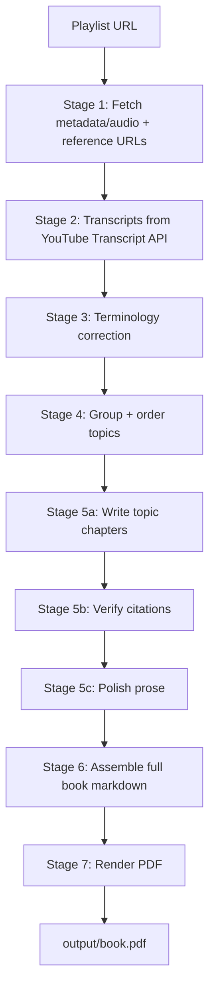

# Bookify

Convert a YouTube playlist into a structured, citation-backed technical PDF book.

## What it produces

- Topic-grouped chapters (not one chapter per video)
- LLM-written prose with citation verification
- Introduction, conclusion, glossary, references
- Final output: `output/book.pdf`

## Current pipeline architecture



## Setup

1. Create venv and install:

```bash
python -m venv .venv
source .venv/bin/activate
pip install -r requirements.txt
```

2. Add API key in `.env`:

```bash
GEMINI_API_KEY=your_key_here
```

3. Configure provider/model in `config.yaml` (default is Gemini Flash).

## Run

Full run:

```bash
DYLD_LIBRARY_PATH=/opt/homebrew/lib python run.py --playlist "https://www.youtube.com/playlist?list=YOUR_LIST_ID"
```

Resume from stage:

```bash
DYLD_LIBRARY_PATH=/opt/homebrew/lib python run.py --playlist "..." --from 3
```

Re-render PDF only:

```bash
DYLD_LIBRARY_PATH=/opt/homebrew/lib python run.py --from 7 --to 7
```

## Key config (current)

```yaml
llm:
  provider: gemini
  model: gemini-flash-latest
  temperature: 0.3

pipeline:
  batch_size: 4
  rate_limit_rpm: 6
  min_words_per_topic: 8000
```

## Checkpoints

Important directories:

- `checkpoints/01_fetch`
- `checkpoints/01b_ref_content`
- `checkpoints/02_transcripts`
- `checkpoints/02b_corrected`
- `checkpoints/03_groups`
- `checkpoints/04_topics`
- `checkpoints/04b_verified`
- `checkpoints/04c_polished`
- `checkpoints/05_book`

Audio cache is local-only and ignored from git:

- `checkpoints/audio/`

## Submission notes

- `.claude/` is ignored and should not be committed.
- `checkpoints/audio/` is removed/ignored.
- Checkpoints and generated book artifacts are versioned as required for reproducible runs.
