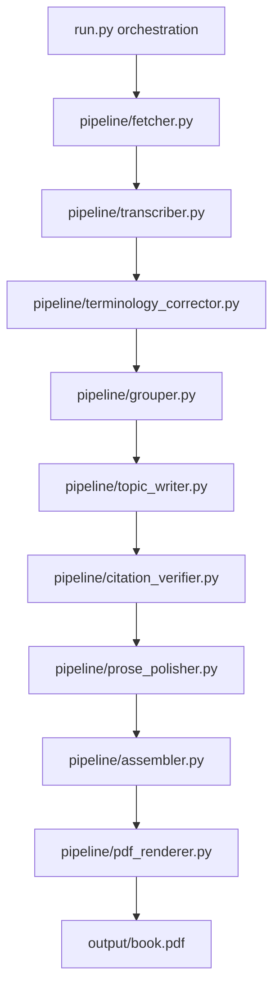
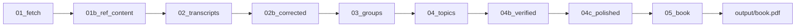

# Bookify Implementation Snapshot (Submission)

## Scope implemented

- Full playlist -> PDF pipeline is operational.
- Checkpoint-driven resumability works across stages.
- Gemini-based LLM stages wired through shared client abstraction.
- PDF renderer includes TOC, citations/footnotes, tables, mermaid diagrams, glossary, and references.

## Implemented architecture



## Data artifacts



## Submission-specific repository rules

- `.claude/` must remain untracked (`.gitignore`).
- `checkpoints/audio/` must be excluded from git and cleaned locally when needed.
- Keep checkpoints for reproducibility of submitted outputs.

## Current config baseline

```yaml
llm:
  provider: gemini
  model: gemini-flash-latest
  temperature: 0.3

pipeline:
  batch_size: 4
  rate_limit_rpm: 6
  min_words_per_topic: 8000
```

## Notes

- Stage 4 writing currently follows configured minimum target, but final generated chapter lengths can still vary by model behavior.
- For deterministic long-form outputs, rerun Stage 4+ with checkpoint reset (`04_*`, `05_book`) and keep model/rate settings fixed.
