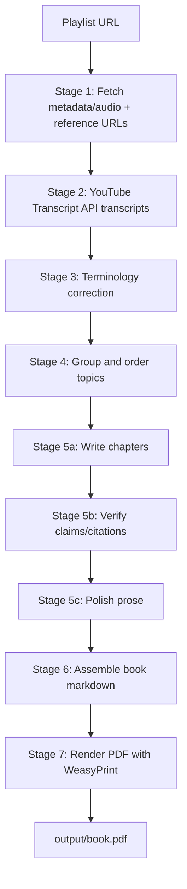
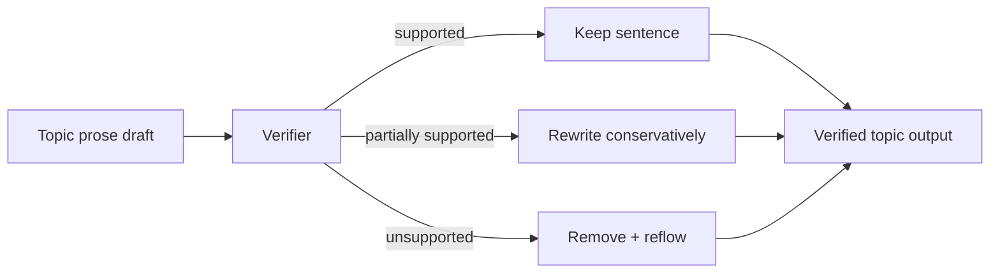

# Bookify Design Spec (Current)

## Goal

Build a reproducible pipeline that turns playlist transcripts into a submission-quality PDF book with verified citations.

## End-to-end flow



## Stage details

1. **Stage 1**: Playlist/video metadata, URL extraction/filtering, reference content snapshotting.
2. **Stage 2**: Transcript collection with checkpoints in `02_transcripts`.
3. **Stage 3**: Technical-term cleanup and transcript normalization.
4. **Stage 4**: Topic clustering and chapter ordering.
5. **Stage 5**: Chapter writing + verification + polish.
6. **Stage 6**: Introduction/conclusion/glossary/references assembly.
7. **Stage 7**: HTML+CSS rendering to final PDF.

## Verification design



## Checkpoint contract

- Pipeline is resumable by stage (`--from`, `--to`).
- Primary checkpoint folders:
  - `01_fetch`, `01b_ref_content`
  - `02_transcripts`, `02b_corrected`
  - `03_groups`
  - `04_topics`, `04b_verified`, `04c_polished`
  - `05_book`
- Local-only audio cache: `checkpoints/audio` (gitignored).

## Runtime config (current baseline)

```yaml
llm:
  provider: gemini
  model: gemini-flash-latest
  temperature: 0.3

pipeline:
  batch_size: 4
  rate_limit_rpm: 6
  min_words_per_topic: 8000
```

## Output quality targets

- Coherent chapter flow by topic dependency.
- Citation markers transformed into footnotes during render.
- References grouped by topic.
- Deterministic reruns from checkpoints for submission reproducibility.
